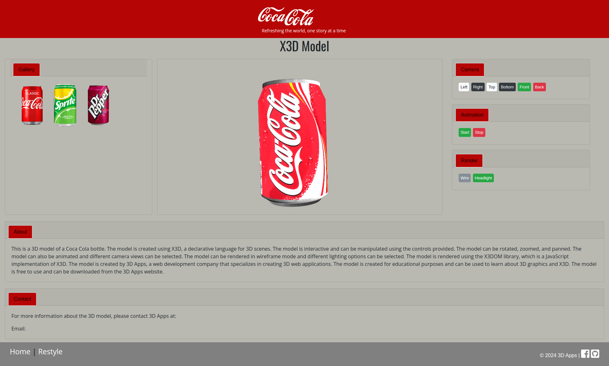

### MVC 3D Web Application using X3DOM

This project is a 3D web application that uses the X3DOM library to render 3D models in a web browser. The application
is built using the Model-View-Controller (MVC) design pattern. The application allows users to view 3D models of
different objects and interact with them using the mouse and keyboard. The application is built using HTML, CSS,
JavaScript, Php, and X3DOM.

### Application Architecture

```
mvc_3d_app/
├── app/
│   ├── Controllers/
│   │   └── Home.php
│   ├── Models/
│   │   └── Item.php
│   ├── Views/
│   │   ├── home/
│   │   │   ├── create.php
│   │   │   ├── edit.php
│   │   │   ├── index.php
│   │   │   └── show.php
│   └── core/
│       ├── App.php
│       └── Controller.php
├── public/
│   └── index.php
│   └── public/
│       ├── assets/
│       │   ├── css/
│       │   │   └── styles.css
│       │   ├── fonts/
│       │   ├── images/
│       │   ├── models/
│       │   └── scripts/
│       │       └── scripts.js
│       └── index.php
├── config/
│   ├── config.php
│   └── apache2.conf
├── docker-compose.yml
└── Dockerfile
```

### Installation

1. Clone the repository
2. Run `docker-compose up` to start the application
3. Open a web browser and navigate to `http://localhost:8080`
4. You should see the home page of the application
5. You can now view 3D models and interact with them using the mouse and keyboard
6. To stop the application, run `docker-compose down`
7. To start the application again, run `docker-compose up`
8. To remove the application, run `docker-compose down --volumes`
9. To access the application files, go to the `public` directory
10. To access the application database, go to `http://localhost:8080/phpmyadmin`

### Usage

1. The home page displays a list of 3D models that users can view
2. Users can click on a model to view it in 3D
3. Users can interact with the model using the mouse and keyboard
4. Users can rotate the model by clicking and dragging the mouse
5. Users can zoom in and out by scrolling the mouse wheel
6. Users can pan the model by holding down the shift key and clicking and dragging the mouse

### Features

1. 3D models of different objects
2. Interactive 3D rendering using X3DOM
3. Model-View-Controller (MVC) design pattern
4. HTML, CSS, JavaScript, Php, and X3DOM
5. Docker containerization
6. PhpMyAdmin for database management
7. Logging and configuration
8. Controllers, models, and views
9. Assets, styles, scripts, images, fonts, and models
10. Responsive design

### Credits

- [X3DOM](https://www.x3dom.org/)
- [Docker](https://www.docker.com/)
- [PhpMyAdmin](https://www.phpmyadmin.net/)
- [Bootstrap](https://getbootstrap.com/)
- [jQuery](https://jquery.com/)
- [Font Awesome](https://fontawesome.com/)

### Screenshots

